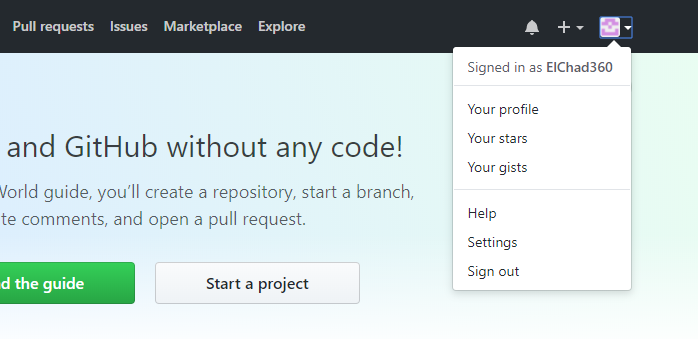
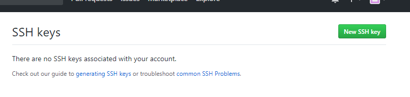
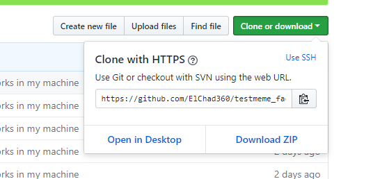

# Module 3: Add the public SSH key to GitHub

In this module you will add the public SSH key to your GitHub account. This will build the communication bridge between the Version Control Tool (GitHub) and our CI/CD orchestration tool (Jenkins) and it is the first step to create an automatized pipeline.

At completion of this module you will be able to use git without the need of the user and password combination.

##  GitHub
GitHub is an excellent Distributed Version Control tool that provides us with a lot of functionalities right out of the box.
One of these functions include the "webhook" function which is a way GitHub can use to notify changes to a repo and trigger a jenkins job.

For our demo, we will use SSH keys to authenticate our jenkins box with GitHub and use either poll or on-demand build triggers.

## Implementation Instructions

1. Go to https://github.com/ and log on to your account. Onced logged in, open **Settings** section from the drop down menu on the top right corner of the home screen.

1. On the **Public profile** screen, click on **SSH and GPG keys** from the **personal settings** column.

1. Click **New SSH key** on the **SSH Keys** section.

1. On the **SSH Keys / Add new** page, add "jenkins" to **Title** box and go back to the Git Bash console.
Type **cat /home/jenkins/.ssh/id_rsa.pub** and copy the key (there is no need to copy the key's comment).
Paste the key on the "Key" box in the GitHub page.

1. Once the key has been pasted, click **Add SSH Key**. This action may request you for the password.

## Cloning from GitHub using SSH keys

On Git Bash try cloning any of your available GitHub projects using SSH keys

1. On the project's page, click on **clone or download** and select the **Use SSH** option from the dropdown menu.

	

1. On Git Bash, create a folder called "tpm" and change to it, by using **mkdir tmp/ && cd tmp/**.

1. Clone the project using the URL obtained from GitHub (**git clone git@github.com:"user"/"project_name.git**).
Cloning using SSH keys should not ask for the password.

1. once it has been cloned, delete this "tmp" folder **cd .. && rm -rf ./tmp**

### Next module

After you have verified that you can clone repos from GitHub using SSH keys, move onto the next module: [Configure Jenkins](../04_ConfigureJenkins)
