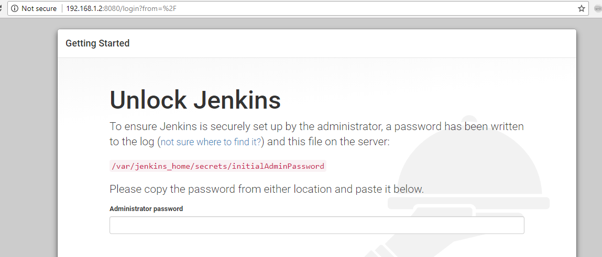
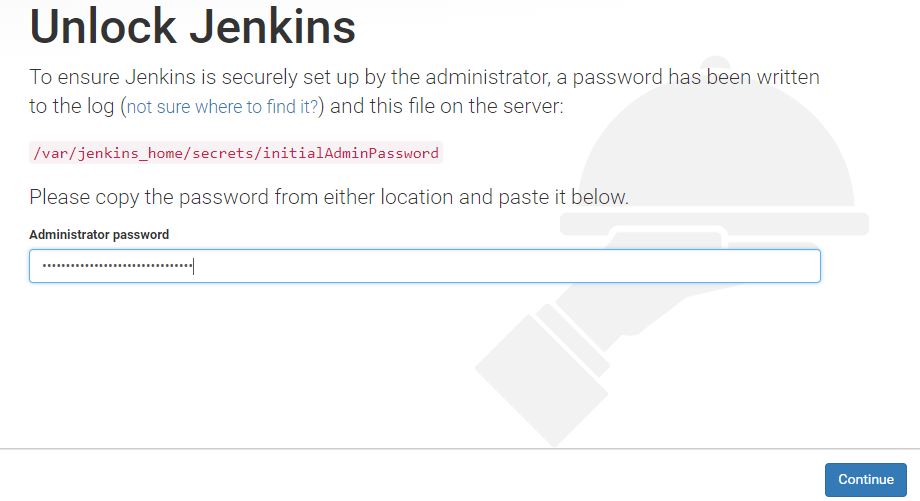
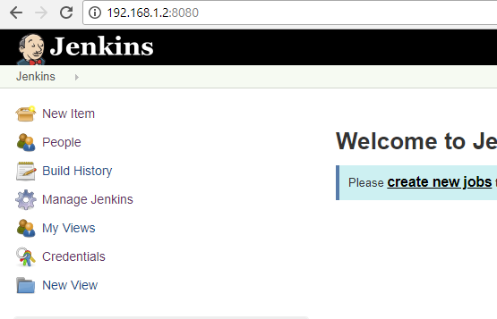
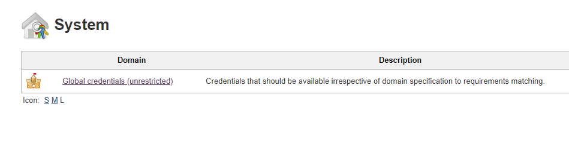
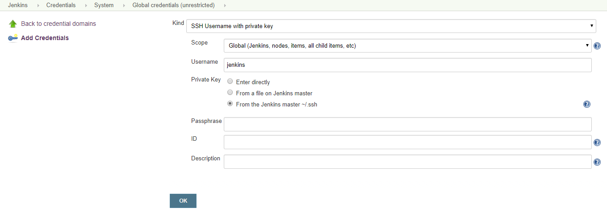
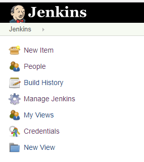
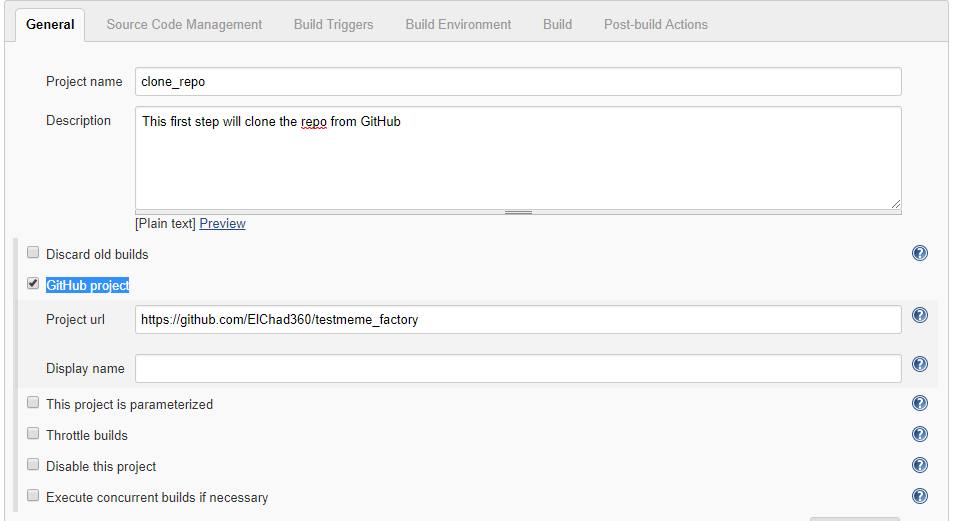

# Module 4: Configure jenkins

In this module you will create a docker container that hosts jenkins that will build our pipeline that runs tests, builds and deploys the website to our prod box.

At completion of this module you will be able to test, build and deploy the website to the remote server.

##  About the web app
Our demo will create a website created in **nodejs**. It is a really simple app that renders a website and contains an even simpler test that will showcase how Jenkins works and how prevents issues from going into production that easily.

Since we will be using an app made on **nodejs** our jenkins container needs to have nodejs installed.
To accomplish this, we will create our own docker image.

Docker can create images that will run on our containers, these can be base images (created from scratch) or use parent images that can be use to create other images.


## Implementation Instructions


1. Go to the project's "jenkins" folder **cd /vagrant/jenkins** and check that the Dockerfile is on this folder.

1. To build and tag our jenkins docker image type **docker build -t npmjenkins:v1 .**.
This will download the Jenkins LTS base image and install Nodejs and NPM on top of it.

1. Confirm that the npmjenkins image was created by typing **docker image ls**.

1. Create the jenkins container with
**docker run -d --name jenkins-kt -p 8080:8080 -p 50000:50000 -v jenkins_home:/var/jenkins_home npmjenkins:v1**.

1. Confirm that the container is running with **docker container ps -a**.

1. Copy the SSH key information to the container with the following commands:
```
docker cp /home/jenkins/.ssh jenkins-kt:/var/jenkins_home/.ssh
docker exec -u root -it jenkins-kt chown jenkins:jenkins /var/jenkins_home/.ssh
docker exec -u root -it jenkins-kt chown jenkins:jenkins /var/jenkins_home/.ssh/id_rsa
docker exec -u root -it jenkins-kt chown jenkins:jenkins /var/jenkins_home/.ssh/known_hosts
```

1. Test that the container can also perform passwordless SSH commands on the prod box:
**docker exec -u jenkins -it jenkins-kt ssh jenkins@192.168.1.3 hostname**
The response should be the hostname of our production box.

Jenkins should now be reachable from the browser (safari, chrome, firefox, etc) on *http://192.168.1.2:8080*

	


## Configure Jenkins

1. On Git Bash type **sudo cat /var/lib/docker/volumes/jenkins_home/_data/secrets/initialAdminPassword** to get the initial password being asked by jenkins.
Copy and past it in the **Administrator password** text box.

1. Click continue



1. Select **Install suggested plugins** and wait for the process to complete

1. Once the plugins are installed, you will be presented with the **Create First Admin User** page.
Complete the form with information requested and click **Save and Finish**


1. On the next window, click on **Start using Jenkins**

1. On the column to the left, click on **Credentials**



1. On the **Credentials** page, click on the **Jenkins** user under **Stores scoped to Jenkins**


1. On the **System** page, click on the **Global credentials**



1. On the **Global credentials (unrestricted)** page, click **Add Credentials** located in the left column.


1. On the next page, select **SSH Username with private key** on **kind**
On **Username** type **jenkins**
On **Private Key** select **From the Jenkins master ~/.ssh**
Click **OK**     




## Setting up the first job

We will create a job that clones our GitHub project

1. From the Jenkins home page, click on **New item**



1. Enter a name for the job and select **Freestyle project**. Click **OK**

1. On **General** add a description and select **GitHub project** to add the project's URL



1. On **Source Code Management** select **Git** and add the repo's clone URL on the **Repository URL** text box.
On the **Credentials** dropdown menu, select "jenkins"


1. On **Build Environment** select **Delete workspace before build starts**.

1. On **Build** click on **Add build step** and select **Execute shell**


1. On the **Command** box, type **git log**. This will connect to GitHub, download the project and run the "git log" command.

1. Click **Save**

To test the job, click on **Build Now**


### Next module


After you have verified the job has successfully cloned the repo and showed the results from the "git log" command, move onto the next module: [Configure deployment](../05_RunProject)
