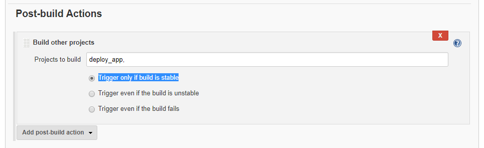

# Module 5: Configure Deployment

In this module you will create two jobs.
The first job will run our project's unit tests and, if it is successful, deploy our website to the production box.


## Implementation Instructions for the "unit test" job

1. From the Jenkins home page, click on **New item**


1. Enter **Unit_test** as the name for the job and select **Freestyle project**. Click **OK**

1. On **General** add a description and select **GitHub project** to add the project's URL

1. On **Source Code Management** select **Git** and add the repo's clone URL on the **Repository URL** text box.
On the **Credentials** dropdown menu, select "jenkins"


1. On **Build Environment** select **Delete workspace before build starts**.

1. On **Build** click on **Add build step** and select **Execute shell**

1. On the **Command** box, type:
```
cd ./app/
npm i --save-dev
node_modules/mocha/bin/mocha test
```


1. Click **Save**

To test the job, click on **Build Now**


## Implementation Instructions for the "deploy job" job

1. From the Jenkins home page, click on **New item**


1. Enter **deploy_app** as the name for the job and select **Freestyle project**. Click **OK**

1. On **General** add a description.

1. On **Build Triggers** select **Build after other projects are built** and add the name of the previous job on the **Projects to watch** text box.
Click **Trigger only if build is stable**


1. On **Build** click on **Add build step** and select **Execute shell**

1. On the **Command** box, type:
```
cd /var/jenkins_home/workspace/Unit_test/app
rm -rf ./node_modules
tar -cvf workshop_node_app.tar .
ssh -i /var/jenkins_home/.ssh/id_rsa jenkins@192.168.1.3 rm -rf /home/jenkins/tmp/
ssh -i /var/jenkins_home/.ssh/id_rsa jenkins@192.168.1.3 mkdir /home/jenkins/tmp/
scp -i /var/jenkins_home/.ssh/id_rsa workshop_node_app.tar jenkins@192.168.1.3:/home/jenkins/tmp
ssh -i /var/jenkins_home/.ssh/id_rsa jenkins@192.168.1.3 tar -xvf /home/jenkins/tmp/workshop_node_app.tar -C /home/jenkins/tmp
ssh -i /var/jenkins_home/.ssh/id_rsa jenkins@192.168.1.3 chmod 700 /home/jenkins/tmp/deploy_app.sh
ssh -i /var/jenkins_home/.ssh/id_rsa jenkins@192.168.1.3 /home/jenkins/tmp/deploy_app.sh
```


1. Click **Save**

1. Go back to the **Unit_test** job and click **Configure**

1. On the **Post-build Actions** section click **Add post-build Actions** and select **Build other projects**


1. Enter the project name **deploy_app** and select **Trigger only if build is stable**



To test the job, click on **Build Now**
**Note** if the jobs fails with **Host key verification failed** try running **docker exec -u root -it jenkins-kt bash** and then **ssh -i /var/jenkins_home/.ssh/id_rsa jenkins@192.168.1.3 rm -rf /home/jenkins/tmp/** from the ops machine.

## Is the WebApp running?
The Nodejs site should be available at **192.168.1.3:8080**
